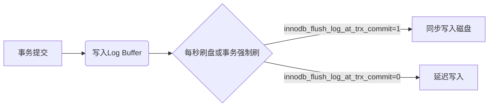
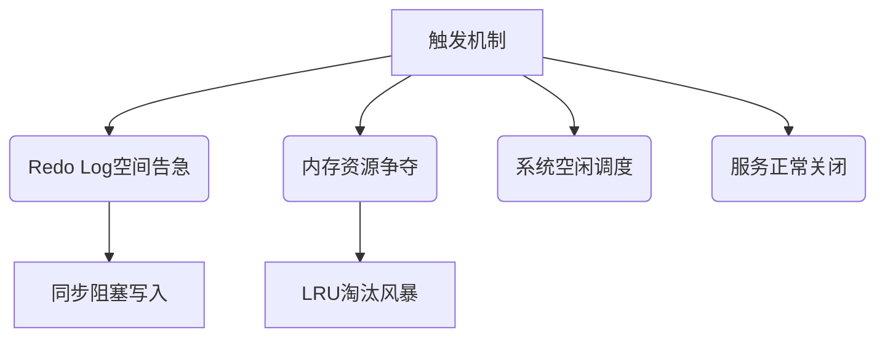
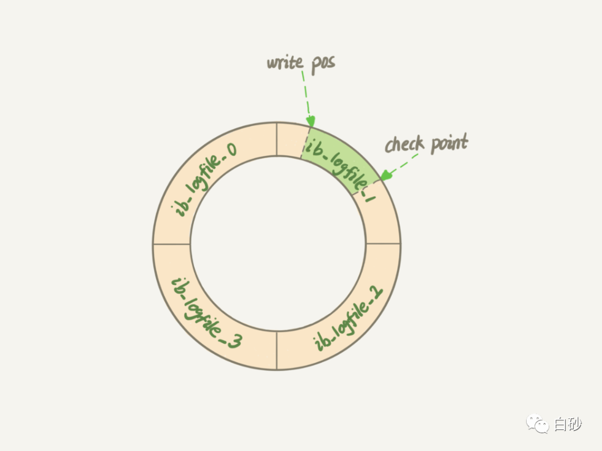
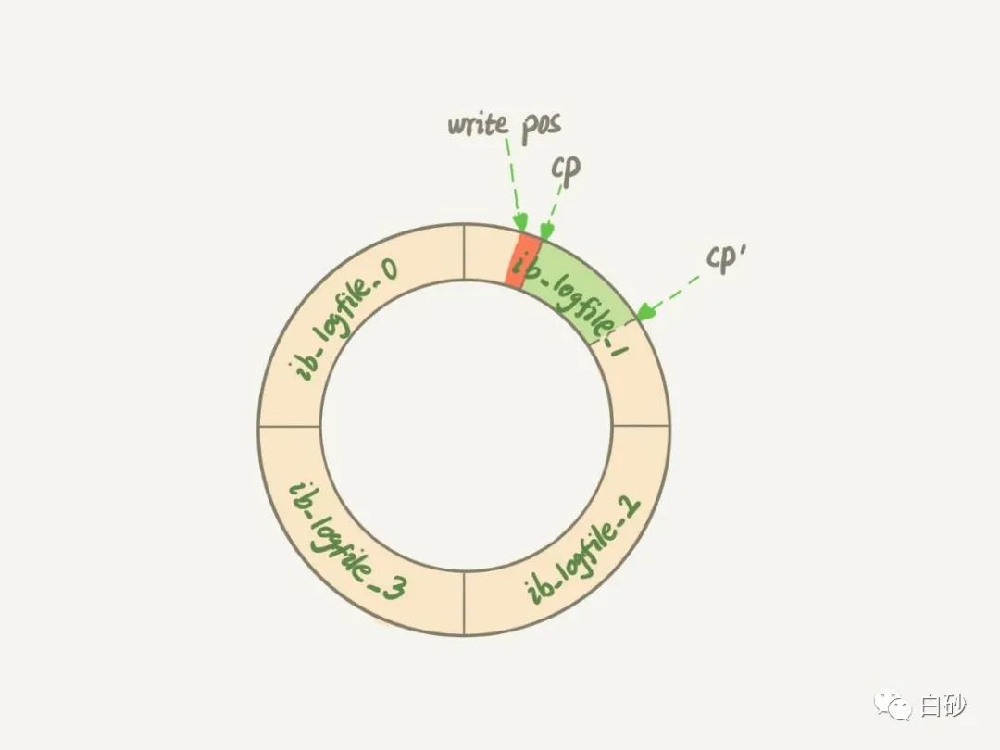
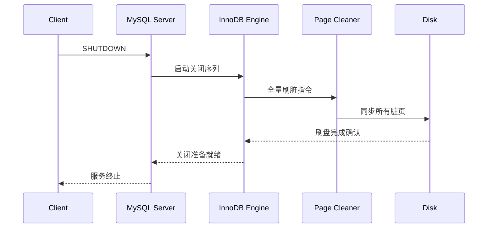
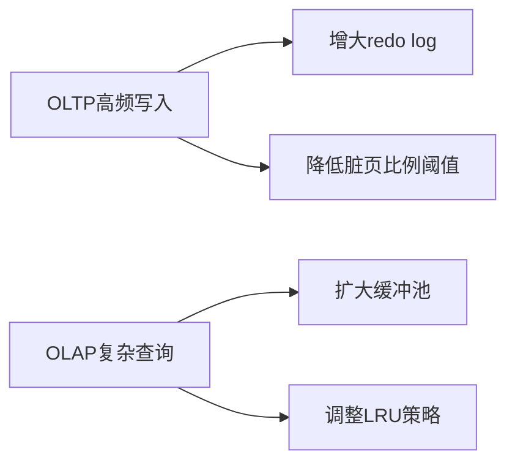

# MySQL 刷盘与Redo Log
在开发的过程中，有时候sql执行会很慢，但是结束之后我们又无法复现，这大概率是MySQL在刷盘。
我们知道InnoDB处理更新语句的时候只修改内存数据页（如果这个数据在内存中，直接进行修改，语句更新结束。如果这个数据不在内存中，则写入`change buffer`中，语句结束）和写`redo log` 这个磁盘操作，并没有实际的更新磁盘数据页。**flush就是把内存里的数据写入磁盘的过程，我们称为刷盘**。


---
## 一、核心概念

### 1. 缓冲池（Buffer Pool）
- **定义**：内存中的核心缓存区域，缓存数据页（默认16KB）和索引页
- **工作原则**：遵循LRU算法管理页淘汰，命中缓冲池的查询无需磁盘I/O
- **监控指标**：`SHOW ENGINE INNODB STATUS`中查看`Buffer pool hit rate`

### 2. 脏页（Dirty Pages）
- **生成条件**：数据页在内存中被修改且未刷入磁盘
- **生命周期**：修改产生→加入Flush List→异步刷盘→转为干净页
- **查看方法**：`SHOW GLOBAL STATUS LIKE 'Innodb_buffer_pool_pages_dirty'`

### 3. Redo Log
redo log是InnoDB独有的机制，它记录的是数据页的物理修改，例如“表空间A中的页B在偏移量C处更新了值D”。这种日志不包含逻辑操作（如SQL语句），而是直接描述数据页的变更细节。
redo log以磁盘文件形式存储（默认文件名为ib_logfile0、ib_logfile1等），采用**循环写入**模式。当文件写满后，会覆盖最旧的内容继续写入。
#### 3.1 核心功能
- **崩溃恢复**：通过物理日志重放未落盘的数据修改
- **WAL实现**：保证事务持久性（ACID中的D）
- **异步刷盘**：日志先行写入，数据页延迟刷盘

#### 3.2 物理结构
```sql
-- 查看日志文件配置
SHOW VARIABLES LIKE 'innodb_log_file%';
```
| 参数                      | 说明                         | 推荐值        |
|---------------------------|----------------------------|-------------|
| innodb_log_file_size      | 单个日志文件大小              | 4GB\~8GB     |
| innodb_log_files_in_group | 日志文件数量                 | 2\~4         |
| innodb_log_group_home_dir | 日志存储路径                | 独立SSD分区 |

#### 3.3 写入流程


#### 3.4 与Binlog对比
| 特性         | Redo Log                     | Binlog               |
|--------------|------------------------------|---------------------|
| 日志类型      | 物理日志（页级修改）           | 逻辑日志（SQL语句）   |
| 作用范围      | InnoDB引擎                   | 所有存储引擎          |
| 写入方式      | 顺序追加                     | 事务提交后写入        |
| 主要用途      | 崩溃恢复                     | 主从复制/数据归档     |

## 二、刷脏触发机制


### 1. Redo Log写满触发

#### 触发原理
redo log 是顺序写的，redo log 的大小是固定的，比如可以一组配置4个文件，每个文件大小是1G，那么这个redo log 可以记录4G。
> write pos 是当前记录的位置，一边写一边后移，写到第 3 号文件末尾后就回到 0 号文件开头。

> checkpoint 是当前要擦除的位置，也是往后推移并且循环的，擦除记录前要把记录更新到数据文件。 



write pos 和 checkpoint 中间空着的部分，就是可以写入的部分，如果write pos 追上了 checkpoint ，代表写满了，就需要停下擦除一部分，把checkpoint推进一下。


如果说把checkpoint 从 cp 的位置 移动到 cp' 的位置，就需要把中间绿色部分对应的所有脏页都 flush 到磁盘上。
也就是说当Redo Log的`write pos`追上`checkpoint`时：

- 所有数据更新操作将被强制暂停（包括DML和DDL）
- Page Cleaner线程立即启动全速刷脏模式
- Checkpoint被强制推进以释放Redo Log空间

#### 故障特征
```sql
-- 检测指标
SHOW GLOBAL STATUS LIKE 'Innodb_log_waits'; -- 出现持续增长
SHOW ENGINE INNODB STATUS\G -- Log sequence number与Log flushed差值超过75%
```

#### 应对办法
| 影响维度         | 表现特征                          | 优化策略                      |
|------------------|-----------------------------------|------------------------------|
| 业务连续性       | 更新操作完全阻塞（TPS=0）         | 增大innodb_log_file_size     |
| 恢复时间         | 刷脏时长与数据修改量正相关         | 采用多副本Redo Log文件架构   |
| 系统资源消耗     | I/O吞吐量瞬间达到峰值              | 分离Redo Log与数据文件存储   |

**案例**：电商大促期间因未及时扩展Redo Log，导致高峰期出现短时间业务停顿

### 2. 内存不足触发

#### (1) 淘汰机制三维模型


**淘汰策略**
- **LRU链表扫描**：以`innodb_lru_scan_depth`定义尾部扫描深度（默认1024页）
- **冷热数据分离**：Young区（63:37分界）与Old区动态调整
- **双链表协同**：Flush List维护脏页顺序，Free List管理可用页

#### (2) 性能雪崩场景
```bash
# 典型异常日志特征
[Warning] InnoDB: page_cleaner: 1000ms intended loop took 4980ms
[ERROR] InnoDB: Over 95% of the buffer pool is occupied by lock heaps
```

**应对策略**：
1. 扩大缓冲池：`innodb_buffer_pool_size`设置为物理内存的60-80%
2. 优化查询模式：避免全表扫描产生大量临时页
3. 升级内存硬件：缓解物理内存不足的根本问题

---

### 3.空闲时段触发（最理想场景）

#### 核心控制参数
| 参数名                      | 动态调整 | 作用域         | 推荐值        |
|----------------------------|----------|----------------|-------------|
| innodb_idle_flush_pct      | Yes      | 全局           | 50-70%      |
| innodb_adaptive_flushing    | Yes      | 全局           | ON          |
| innodb_flush_sync          | Yes      | 全局           | OFF         |

#### 调度优化实践
- **负载预测**：结合历史QPS曲线预判空闲窗口
- **分级刷脏**：优先处理修改时间超过30分钟的旧脏页
- **IO节流**：设置`innodb_io_capacity_max`防止过度占用磁盘带宽

---

### 4. 关闭服务触发
#### 关闭流程


#### 加速关闭
- **预热机制**：通过`innodb_buffer_pool_load_at_startup`减少冷启动刷脏
- **快速关闭模式**：设置`innodb_fast_shutdown=1`跳过undo log清理
- **并行刷脏**：MySQL 8.0+启用`innodb_page_cleaners=4`（按CPU核数调整）

---


## 三、性能优化进阶策略

### 1. 多维度监控体系
```sql
/* 实时监控脚本 */
SELECT
(SELECT VARIABLE_VALUE
FROM information_schema.GLOBAL_STATUS
WHERE VARIABLE_NAME = 'Innodb_buffer_pool_pages_dirty')
/
(SELECT VARIABLE_VALUE
FROM information_schema.GLOBAL_STATUS
WHERE VARIABLE_NAME = 'Innodb_buffer_pool_pages_total')
AS dirty_ratio;
```

### 2. 参数调优矩阵
| 参数                      | 机械硬盘优化值 | SSD优化值 | 云盘优化建议       |
|---------------------------|---------------|-----------|-------------------|
| innodb_io_capacity        | 200-500       | 5000+     | 按云厂商文档设置    |
| innodb_flush_neighbors    | 1             | 0         | 禁用（云环境）     |
| innodb_lru_scan_depth     | 512           | 2048      | 根据iops动态调整   |

### 3. 混合负载场景优化


## 四、故障排查

### 1. 性能抖动分析
```bash

# 快速诊断命令
mysqladmin ext -i1 | egrep "Innodb_buffer_pool_pages_dirty|Innodb_log_waits"
```

### 2. 常见问题处理
**案例1：日志等待突增**
```sql
-- 检查日志写入瓶颈
SHOW GLOBAL STATUS LIKE 'Innodb_log_waits';
-- 解决方案：增大innodb_log_file_size
```

**案例2：刷脏导致查询延迟**
```sql
-- 分析IO压力
SELECT EVENT_NAME, COUNT_STAR
FROM performance_schema.events_waits_summary_global_by_event_name
WHERE EVENT_NAME LIKE '%innodb%';
-- 优化方案：升级存储或调整innodb_io_capacity
```
---

> 参考文章：
> - [MySQL · 源码分析 · InnoDB LRU List刷脏改进之路](https://www.bookstack.cn/read/aliyun-rds-core/df65d64eb6319091.md)
> - [MySQL学习之flush(刷脏页)](https://www.modb.pro/db/50669)
> - [Mysql数据库缓存池Buffer Pool 冷热数据分离](https://www.cnblogs.com/maz9666/p/14447334.html)