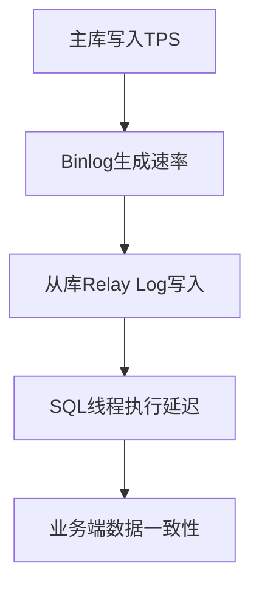

# MySQL 主从同步

## 一、主从同步核心原理
MySQL主从复制基于二进制日志（binlog）实现，主库将数据变更记录到binlog，从库通过I/O线程拉取binlog并写入中继日志（relay log），最后由SQL线程执行中继日志中的事件完成数据同步。核心组件包含：
- **主库**：Binary Log Dump Thread（发送binlog）
- **从库**：I/O Thread（接收binlog）和 SQL Thread（执行变更）

---

## 二、主从配置全流程

### 1. 基础环境准备
```bash

#版本要求（建议使用相同大版本）
主库：MySQL 8.0.32
从库：MySQL 8.0.32

#网络要求：
主从间3306端口互通，建议内网专线
```

### 2. 主库配置
**步骤1：修改配置文件（/etc/mysql/my.cnf）**
```ini
[mysqld]
server-id = 1 # 必须全局唯一
log_bin = /var/log/mysql/bin.log # 开启二进制日志
binlog_format = ROW # 推荐行级复制模式
binlog_do_db = app_db # 指定同步数据库（可选）
expire_logs_days = 7 # binlog保留周期
```

**步骤2：创建同步账号**
```sql
CREATE USER 'repl'@'192.168.1.%' IDENTIFIED BY 'SecurePass123!';
GRANT REPLICATION SLAVE ON . TO 'repl'@'192.168.1.%';
FLUSH PRIVILEGES;
```

**步骤3：查看主库状态**
```sql
SHOW MASTER STATUS; -- 记录File和Position值（如mysql-bin.000003 | 154）
```
```bash
mysql> show master status;
+------------------+----------+--------------+------------------+-------------------+
| File             | Position | Binlog_Do_DB | Binlog_Ignore_DB | Executed_Gtid_Set |
+------------------+----------+--------------+------------------+-------------------+
| mysql-bin.000036 |      145 |              |                  |                   |
+------------------+----------+--------------+------------------+-------------------+
```

### 3. 从库配置
**步骤1：修改配置文件**
```ini
[mysqld]
server-id = 2
relay_log = /var/log/mysql/relay.log
read_only = 1 # 从库只读模式
replicate_do_db = app_db # 指定同步数据库（需与主库一致）
log_slave_updates = 1 # 级联复制时需要开启
```

**步骤2：建立主从关系**
```sql
CHANGE MASTER TO
MASTER_HOST='192.168.1.101',
MASTER_USER='repl',
MASTER_PASSWORD='SecurePass123!',
MASTER_LOG_FILE='mysql-bin.000003',
MASTER_LOG_POS=154;

START SLAVE; -- 启动同步
```

```bash
#查看状态
mysql> show slave status\G

*************************** 1. row ***************************
               Slave_IO_State: Waiting for master to send event
                  Master_Host: 192.168.172.1
                  Master_User: replication
                  Master_Port: 3306
                Connect_Retry: 60
              Master_Log_File: mysql-bin.000036
          Read_Master_Log_Pos: 2791
               Relay_Log_File: iZbp130bctfwzp21byvh5iZ-relay-bin.000004
                Relay_Log_Pos: 3004
        Relay_Master_Log_File: mysql-bin.000036
             Slave_IO_Running: Yes
            Slave_SQL_Running: Yes
              Replicate_Do_DB:
          Replicate_Ignore_DB:
           Replicate_Do_Table:
       Replicate_Ignore_Table:
      Replicate_Wild_Do_Table:
  Replicate_Wild_Ignore_Table:
                   Last_Errno: 0
                   Last_Error:
                 Skip_Counter: 0
          Exec_Master_Log_Pos: 2791
              Relay_Log_Space: 3395
              Until_Condition: None
               Until_Log_File:
                Until_Log_Pos: 0
           Master_SSL_Allowed: No
           Master_SSL_CA_File:
           Master_SSL_CA_Path:
              Master_SSL_Cert:
            Master_SSL_Cipher:
               Master_SSL_Key:
        Seconds_Behind_Master: 0
Master_SSL_Verify_Server_Cert: No
                Last_IO_Errno: 0
                Last_IO_Error:
               Last_SQL_Errno: 0
               Last_SQL_Error:
  Replicate_Ignore_Server_Ids:
             Master_Server_Id: 10
                  Master_UUID: 3bc22fe9-6286-11ea-aafc-00163e0ab58e
             Master_Info_File: /usr/local/mysql/var/master.info
                    SQL_Delay: 0
          SQL_Remaining_Delay: NULL
      Slave_SQL_Running_State: Slave has read all relay log; waiting for more updates
           Master_Retry_Count: 86400
                  Master_Bind:
      Last_IO_Error_Timestamp:
     Last_SQL_Error_Timestamp:
               Master_SSL_Crl:
           Master_SSL_Crlpath:
           Retrieved_Gtid_Set:
            Executed_Gtid_Set:
                Auto_Position: 0
         Replicate_Rewrite_DB:
                 Channel_Name:
           Master_TLS_Version:
```

```bash
# 重点观察以下字段：
- `Slave_IO_Running`: Yes（I/O线程状态）
- `Slave_SQL_Running`: Yes（SQL线程状态）
- `Seconds_Behind_Master`: 0（同步延迟秒数）
- `Last_IO_Error`: 错误信息提示
```

### 4. 数据初始化（三种方式）
| 方式              | 适用场景                          | 操作命令示例                         |
|-------------------|---------------------------------|------------------------------------|
| **mysqldump**     | <50GB数据库                     | `mysqldump --single-transaction -uroot -p app_db > dump.sql` |
| **Clone Plugin**  | MySQL 8.0+，大数据量场景         | `INSTALL PLUGIN clone SONAME 'mysql_clone.so';` |
| **物理备份**       | TB级数据库，使用Percona XtraBackup | `xtrabackup --backup --target-dir=/data/backup/` |

---

## 三、同步状态监控
### 1. 关键监控命令
```sql
SHOW SLAVE STATUS\G
```

### 2. 监控指标看板


---

## 四、常见问题与解决方案

### 1. 同步中断问题
**场景1：主键冲突**
```sql
-- 错误信息：Duplicate entry '1001' for key 'PRIMARY'
-- 解决方案：
SET GLOBAL SQL_SLAVE_SKIP_COUNTER=1; -- 跳过错误事件
START SLAVE;
```

**场景2：网络闪断**
```bash
#查看网络连通性
tcping 192.168.1.101 3306 -t

#自动重连参数设置（my.cnf）
master-connect-retry=60 # 重试间隔秒数
```

### 2. 数据延迟优化
**产生原因**

  -  主库TPS（每秒事务数，Transactions Per Second）并发较高，产生的DDL数量超过从库一个SQL线程所能承受的范围，产生了延迟；
- 从库大型SELECT语句产生了锁等待；

**优化策略**
| 优化方向         | 具体措施                                                                         |
|------------------|---------------------------------------------------------------------------------|
| **硬件升级**     | 从库使用NVMe SSD，内存扩容至主库1.5倍；增加从库机器                                 |
| **并行复制**     | 设置`slave_parallel_workers=8`                                                   |
| **批量提交**     | 调整`slave_rows_search_algorithms=INDEX_SCAN,HASH_SCAN`                          |
| **过滤规则**     | 通过`replicate_wild_ignore_table=app_db.log_%` 过滤非关键表                       |
| **磁盘保存数据**     | 设置主库sync_binlog=1,即每1次事务提交，将binlog_cache中的数据写入磁盘。从库设为0，文件系统自行决定。|
| **磁盘保存事务提交**     | 设置主库innodb_flush_log_at_trx_commit=1,即每1次事务提交，把写入磁盘。从库设为0或2，不写入或写入系统缓存|
| **查询优化**     | 检查从库的查询语句并优化                                                           |

### 3. 主从不一致修复
**校验工具选择**
```bash
#使用pt-table-checksum
pt-table-checksum --nocheck-replication-filters --no-check-binlog-format
--databases=app_db --replicate=test.checksums u=root,p=password
#修复不一致数据
pt-table-sync --execute --replicate test.checksums h=主库IP,D=app_db,u=root,p=password
```

---

## 五、高级配置

### 1. 半同步复制（Semi-Sync）
```sql
-- 主库安装插件
INSTALL PLUGIN rpl_semi_sync_master SONAME 'semisync_master.so';
SET GLOBAL rpl_semi_sync_master_enabled=1;

-- 从库启用
INSTALL PLUGIN rpl_semi_sync_slave SONAME 'semisync_slave.so';
SET GLOBAL rpl_semi_sync_slave_enabled=1;
```
**优势**：确保至少一个从库接收数据后才返回成功，数据可靠性更高

### 2. GTID复制模式
GTID（Global Transaction Identifier，全局事务标识符）是MySQL 5.6及以上版本引入的一种基于事务的复制模式，用于替代传统的基于二进制日志文件（Binlog）和位置点（Position）的经典复制模式。GTID通过为每个事务分配一个全局唯一的标识符，确保事务在主从数据库中的唯一性和一致性，从而简化了复制配置和故障恢复过程。

```ini
#my.cnf配置
gtid_mode=ON
enforce_gtid_consistency=ON
```

**优势**：
- 无需关注binlog文件名和位置
- 支持自动故障切换
- 级联复制更稳定

---

## 六、生产环境
1. **监控体系**：部署Prometheus + Grafana监控主从状态、延迟、线程状态等关键指标
2. **灾备方案**：至少配置1主2从，跨机房部署从库
3. **定期演练**：每季度执行主从切换测试（`SHOW PROCESSLIST; STOP SLAVE; START SLAVE;`）

