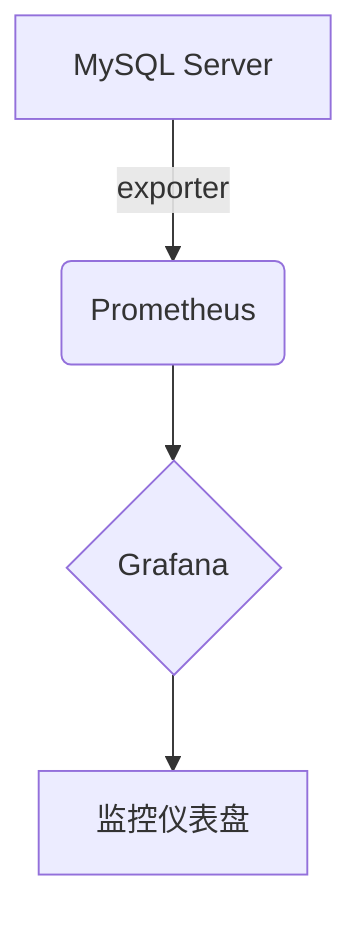
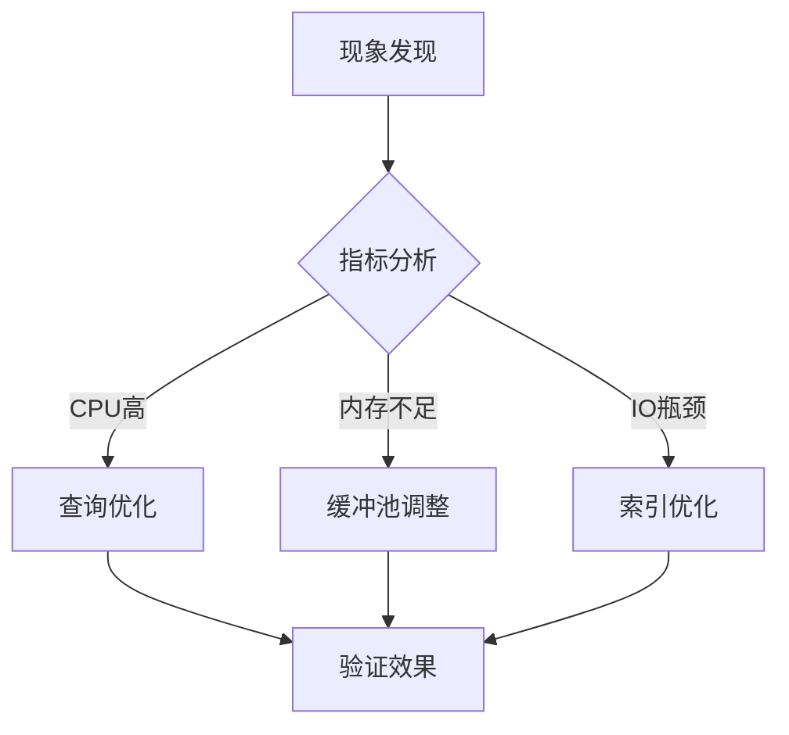

# MySQL性能监控


## 一、官方性能监控工具

### 1. Performance Schema（性能模式）
MySQL内置的底层监控机制，通过内存表存储实时性能数据(#user-content-evidence1)(#user-content-evidence2)：
```sql
-- 查看当前活跃线程
SELECT * FROM performance_schema.threads WHERE PROCESSLIST_STATE IS NOT NULL;
```
**功能特性**：
- 支持原子事件和分子事件监控
- 提供历史事件记录（`events_waits_history`表）
- 支持动态配置（通过UPDATE语句调整监控项）

### 2. 状态变量与系统命令
```sql
SHOW GLOBAL STATUS LIKE 'Threads_connected'; -- 查看当前连接数
SHOW ENGINE INNODB STATUS; -- InnoDB引擎状态
EXPLAIN SELECT * FROM users WHERE age > 30; -- 查询执行计划分析
```
**核心指标**：
- `Queries`：总查询次数
- `Slow_queries`：慢查询计数
- `Innodb_row_lock_time_avg`：平均行锁等待时间(#user-content-evidence5)

### 3. 慢查询日志分析
```bash
# 按执行时间排序前5的慢查询
mysqldumpslow -s t -t 5 /var/log/mysql/slow.log
```

**配置参数**：
```ini
slow_query_log = 1
long_query_time = 2 # 超过2秒视为慢查询
log_queries_not_using_indexes = 1
```


---

## 二、第三方监控方案

### 1. Percona Toolkit
**核心组件**：
- **pt-query-digest**：慢日志分析
- **pt-deadlock-logger**：死锁记录
- **pt-mext**：多服务器状态对比(#user-content-evidence13)

### 2. Prometheus + Grafana
**部署架构**：

**关键步骤**：
1. 部署`mysqld_exporter`采集指标
2. Prometheus配置抓取规则
3. 导入Percona提供的[官方Dashboard模板](https://github.com/percona/grafana-dashboards)(#user-content-evidence15)

### 3. Zabbix监控模板
**监控项示例**：

| 监控项名称          | 键值                          | 单位 |
|---------------------|-------------------------------|------|
| MySQL每秒查询量      | mysql.queries.per_second     | QPS  |
| InnoDB缓冲池命中率  | mysql.innodb.buffer_pool_hit | %    |
| 活动线程数          | mysql.threads.running        | 个   |


---

## 三、核心性能指标解读

### 1. 吞吐量指标

| 指标名称       | 计算公式                              | 健康范围     |
|----------------|---------------------------------------|--------------|
| QPS            | (Com_select+Com_insert+...)/Uptime   | < 5000       |
| TPS            | (Com_commit+Com_rollback)/Uptime     | < 1000       |
| 网络吞吐量     | Bytes_received + Bytes_sent          | 根据硬件调整 |


### 2. 资源使用率
```sql
-- 内存使用分析
SELECT * FROM sys.memory_global_by_current_bytes
WHERE current_alloc > 100000000; -- 显示超过100MB的内存分配
```
**关键阈值**：
- **CPU使用率**：持续>70%需关注
- **InnoDB缓冲池使用率**：应>90%
- **临时表磁盘使用率**：应<5%

### 3. 锁与事务
```sql
-- 查看当前锁等待
SELECT * FROM information_schema.INNODB_LOCK_WAITS;
```
**重要指标**：
- `innodb_row_lock_waits`：行锁等待次数
- `Table_locks_waited`：表锁等待次数
- `Deadlocks`：死锁发生次数(#user-content-evidence24)

---

## 四、日志分析实战

### 1. 错误日志排查
```bash

# 查找最近1小时的错误记录
grep -i 'ERROR' /var/log/mysql/error.log | awk '$1 >= "2023-08-01T12:00:00"'
```

**常见错误类型**：
- `[ERROR] InnoDB: Disk is full`
- `[Warning] Aborted connection`

### 2. 二进制日志分析
```bash
mysqlbinlog --base64-output=decode-rows -v binlog.00001
```
**关键事件**：
- `# at 1234`：事件位置
- `Table_map`：表映射事件
- `Write_rows`：数据写入事件


---

## 五、自动化监控体系搭建

### 1. 告警规则配置（示例）
```yaml

# Prometheus alert.rules
groups:

name: MySQL Alerts
rules:
alert: HighCPUUsage
expr: 100 - (avg by(instance)(rate(node_cpu_seconds_total{mode="idle"}[5m])) * 100) > 85
for: 5m
labels:
severity: critical
annotations:
summary: "MySQL CPU使用率过高 ({{ $value }}%)"
```

### 2. 监控面板设计要点
**核心组件**：
- 实时QPS/TPS曲线
- 连接池使用率仪表盘
- 慢查询类型分布饼图

### 3. 最佳实践建议
1. **基线建立**：记录正常负载时的指标范围
2. **分层监控**：
   - 基础设施层：CPU/内存/磁盘
   - 数据库层：查询效率/锁等待
   - 业务层：事务成功率/响应时间
3. **定期健康检查**：
```bash
使用mysqlcheck工具
mysqlcheck -u root -p --all-databases --check --optimize
```

---

## 六、常见问题解决方案

### 1. 性能问题排查矩阵

| 现象                | 可能原因                  | 排查工具               |
|---------------------|---------------------------|------------------------|
| CPU持续满载         | 低效查询/索引缺失         | EXPLAIN/pt-query-digest|
| 内存使用率过高      | 缓冲池配置不当/内存泄漏   | SHOW ENGINE INNODB STATUS|
| 连接数暴涨          | 连接池泄露/慢查询堆积     | SHOW PROCESSLIST       |


### 2. 典型故障处理流程
