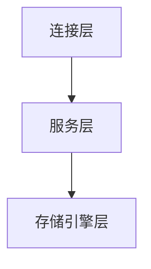
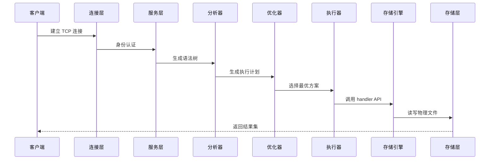

# MySQL 分层架构与核心组件

## 一、分层架构设计
MySQL 采用经典的**三层模块化架构**，实现逻辑解耦与高扩展性。不同层级通过标准化接口通信，支持灵活的功能扩展（如插件式存储引擎）。




### 1. 各层核心职责对比
| 层级              | 核心功能                                                                 | 技术实现特点                                                                 |
|-------------------|--------------------------------------------------------------------------|------------------------------------------------------------------------------|
| **连接层**        | 客户端连接管理、安全认证、协议转换                                      | 支持 TCP/IP、Socket 等协议，采用线程池管理（1:1 线程模型）        |
| **服务层**        | SQL 解析、查询优化、内置函数、跨引擎功能（视图/存储过程）                | 包含查询缓存（8.0 已废弃）、分析器、优化器等核心模块             |
| **存储引擎层**    | 数据存储/检索、索引实现、事务控制                                        | 插件式架构，支持 InnoDB、MyISAM 等多引擎共存                       |
| **存储层**        | 物理数据文件存储（表数据、日志、索引）                                   | 文件系统级存储，与引擎强耦合（如 InnoDB 的 .ibd 文件）           |

---

## 二、核心组件

### 1. 连接层组件
#### (1) 连接管理器
- **线程池机制**：采用 1:1 线程模型，通过 `SHOW STATUS LIKE 'Threads_%'` 监控连接状态
- **认证体系**：双重验证（用户名+主机权限），支持 SSL/TLS 加密传输
- **连接控制**：
```sql
SET GLOBAL max_connections=2000; -- 最大连接数设置
SET GLOBAL wait_timeout=300; -- 空闲连接超时控制
```

#### (2) 协议适配器
**支持多种通信协议**：
| 连接类型  | 传输方式       | 适用场景         | 安全性 |
|-----------|----------------|------------------|--------|
| TCP/IP    | 网络层协议     | 远程访问         | 中      |
| Socket    | 本地文件套接字 | 本机高速通信     | 高      |

---


```bash
bash

#TCP/IP 连接示例
mysql -h 127.0.0.1 -P 3306 -u root -p

#Socket 连接示例（本地快速通道）
mysql -S /tmp/mysql.sock -u root -p
```
---

### 2. 服务层核心模块
#### (1) SQL 接口组件
- 处理 DML/DDL 语句
- 实现预处理语句（Prepared Statements）

#### (2) 查询处理器
| 子模块       | 功能说明                                                                 | 关键技术                                                                 |
|--------------|--------------------------------------------------------------------------|--------------------------------------------------------------------------|
| **分析器**   | 语法树构建、语义校验                                                    | 生成抽象语法树（AST）                                              |
| **优化器**   | 基于成本估算（CBO）选择执行计划                                         | 支持索引选择、JOIN 顺序优化、子查询重构                            |
| **执行器**   | 调用存储引擎接口执行操作                                                 | 通过 `EXPLAIN` 查看执行计划                                         |

#### (3) 缓存管理器（MySQL 8.0 已移除）
- 历史作用：缓存完整查询结果集
- 淘汰原因：高并发场景下缓存失效代价过高

---

### 3. 存储引擎层
#### (1) 引擎架构特点
- **插件式设计**：支持动态加载引擎（`.so` 动态库）
- **统一接口**：实现 `handler` 类定义的标准 API
- **表级选择**：不同表可使用不同引擎（`ENGINE=InnoDB`）

#### (2) 主流引擎对比
| 特性               | InnoDB                          | MyISAM               | Memory             |
|--------------------|---------------------------------|---------------------|--------------------|
| **事务支持**       | ACID 兼容（MVCC）               | ❌                  | ❌                 |
| **锁粒度**         | 行级锁 + 意向锁                 | 表级锁              | 表级锁             |
| **崩溃恢复**       | 通过 Redo Log 实现              | 需手动修复           | 数据丢失           |
| **外键约束**       | ✅                              | ❌                  | ❌                 |
| **索引结构**       | 聚簇索引（B+Tree）              | 非聚簇索引（B+Tree） | Hash 索引          |
| **适用场景**       | OLTP 高并发事务                 | 只读报表            | 临时表/缓存        |

#### (3) InnoDB 核心机制
- **缓冲池**：通过 `innodb_buffer_pool_size` 控制内存使用（建议 70-80% 物理内存）
- **日志系统**：
- Redo Log：保证事务持久性（WAL 机制）
- Undo Log：实现事务回滚和 MVCC
- **锁系统**：
- 行锁类型：记录锁、间隙锁、临键锁
- 死锁检测：通过 `SHOW ENGINE INNODB STATUS` 查看死锁信息

---

## 三、跨层级协作流程
### 1. SQL 执行全链路


### 2. 关键参数配置
```ini
[mysqld]

#连接控制
max_connections = 2000
thread_cache_size = 100

#InnoDB 优化
innodb_buffer_pool_size = 64G
innodb_flush_log_at_trx_commit = 1
innodb_file_per_table = ON

#查询缓存（8.0+ 已移除）
query_cache_type = 0
```

---

## 四、架构优势
1. **扩展性**：插件式引擎设计允许按需选择存储方案
2. **高性能**：通过线程池、缓冲池等多级缓存提升吞吐量
3. **可靠性**：WAL 机制 + Redo Log 实现崩溃安全
4. **兼容性**：标准 SQL 接口屏蔽底层存储差异


