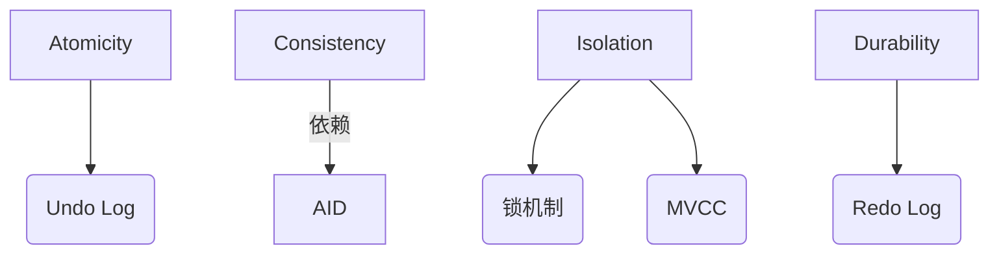

# MySQL事务机制

## 一、MySQL存储引擎

### 1.1 核心存储引擎对比

| 存储引擎     | 事务支持 | 锁机制        | 适用场景                     | 典型特性                     |
|--------------|----------|---------------|------------------------------|------------------------------|
| **InnoDB**   | ✅        | 行锁/表锁     | OLTP系统、高并发读写          | 支持外键、ACID事务            |
| MyISAM       | ❌        | 表锁          | 只读/低写入操作               | 全文索引、压缩表              |
| Memory       | ❌        | 表锁          | 临时数据缓存                  | 内存存储、快速访问            |
| Archive      | ❌        | 行锁          | 日志归档                      | 高压缩比、只支持插入查询      |
| NDB Cluster  | ✅        | 行锁          | 分布式集群                    | 99.999%高可用性               |
| CSV          | ❌        | 表锁          | 数据交换                      | 直接编辑CSV文件               |
| Blackhole    | ❌        | -             | 数据复制过滤                  | 不存储数据，仅转发            |


### 1.2 引擎选型决策树
1. **事务需求** → 选择InnoDB/XtraDB
2. **高并发写入** → InnoDB行级锁
3. **数据归档** → Archive引擎
4. **内存计算** → Memory引擎
5. **地理分布** → NDB Cluster

> 特别说明：Percona Server默认使用改进版XtraDB引擎，在InnoDB基础上增强了监控和性能优化

---

## 二、事务操作核心命令

### 2.1 基础事务控制语句
```sql
-- 显式开启事务（需关闭autocommit）
START TRANSACTION;
-- 或
BEGIN;

-- 提交事务
COMMIT;

-- 回滚到事务起点
ROLLBACK;

-- 创建保存点
SAVEPOINT savepoint1;

-- 回滚到指定保存点
ROLLBACK TO savepoint1;
```

### 2.2 自动提交控制
```sql
-- 查看自动提交状态
SHOW VARIABLES LIKE 'autocommit';

-- 关闭自动提交（会话级）
SET autocommit = 0;

-- 永久配置（需修改my.cnf）
[mysqld]
autocommit = 0
```


---

## 三、ACID特性

### 3.1 实现架构图


### 3.2 解析
1. **原子性保障**  
   - Undo Log记录反向操作
   - 事务失败时执行回滚日志

2. **持久性实现**  
   - Redo Log顺序写入（WAL原则）
   - Crash Recovery机制保证数据恢复

3. **隔离性控制**  
   - 行锁+间隙锁（Next-Key Locking）
   - MVCC多版本并发控制

4. **一致性保障**  
   - 双写缓冲区防止页损坏
   - 外键约束自动校验

---

## 四、并发问题

### 4.1 典型问题对照

| 问题类型         | 发生场景        | 示例                       |
|------------------|-----------------------------------|---------------------------|
| **脏读**         | 读取未提交的数据      | 当前事务读取另一个事务尚未提交的修改, 这个修改被回滚，导致脏读    |
| **不可重复读**    | 两次同样查询结果不一致      | 同一查询在同一事务多次进行，由于其他事务所作的修改或删除操作，多次查询返回不同结果, 发生不可重复读        |
| **幻读**         | 范围查询出现新记录    | 同一查询在同一事务多次进行，由于其他事务所作的新增操作，多次查询后出现新的记录，导致幻读    |


---

## 五、事务隔离级别

### 5.1 隔离级别对照

| 隔离级别           | 脏读 | 不可重复读 | 幻读 | 锁机制强度 |
|--------------------|------|------------|------|------------|
| 读未提交           | ✅    | ✅          | ✅    | 无锁       |
| 读已提交           | ❌    | ✅          | ✅    | 行级锁     |
| 可重复读（默认）   | ❌    | ❌           | ❌¹   | 间隙锁     |
| 串行化             | ❌    | ❌          | ❌    | 表级锁     |


> 注¹：InnoDB通过Next-Key Locking基本解决幻读

### 5.2 隔离级别设置
```sql
-- 查看当前隔离级别
SELECT @@transaction_isolation;

-- 设置会话级隔离级别
SET SESSION TRANSACTION ISOLATION LEVEL READ COMMITTED;

-- 全局设置（需重启生效）
SET GLOBAL TRANSACTION ISOLATION LEVEL REPEATABLE READ;
```


---

## 六、锁机制与应用

### 6.1 锁类型

| 锁类型       | 粒度   | 冲突检测           | 说明和适用场景                 |
|--------------|--------|--------------------|--------------------------|
| 共享锁(S)    | 行/表  | 与排他锁互斥       | 允许多个事务同时读取数据，但不允许修改数据，适合高并发读                 |
| 排他锁(X)    | 行/表  | 与其他锁均互斥     | 只允许一个事务修改数据，其他事务无法读取或修改该数据，适合数据修改操作             |
| 表级锁| 表     |  -     | 锁定整个表，操作期间其他事务不能访问该表的任何数据，适合表迁移             |
| 意向共享锁(IS)| 表     | 提前声明锁意向     | 记录事务对表或行的锁定意图，防止死锁的发生，适合多粒度锁协调             |
| 间隙锁       | 索引区间| 防止区间插入       | 解决幻读问题             |


### 6.2 显式锁命令应用
```sql
-- 行级排他锁（悲观锁实现）
SELECT * FROM accounts WHERE id = 1 FOR UPDATE;

-- 表级写锁
LOCK TABLES orders WRITE;

-- 死锁检测（需开启监控）
SHOW ENGINE INNODB STATUS;

-- 锁等待超时设置
SET innodb_lock_wait_timeout = 50;
```

**典型应用场景**：  
1. 库存扣减（SELECT FOR UPDATE）  
2. 批量数据迁移（LOCK TABLES）  
3. 财务对账（SERIALIZABLE隔离）

---

## 七、最佳实践

### 7.1 设计原则
1. **短事务优先**：单个事务执行时间<100ms
2. **精确锁范围**：优先使用行锁代替表锁
3. **隔离级别权衡**：默认使用REPEATABLE READ
4. **死锁预防**：统一资源访问顺序
5. **监控策略**：定期分析SHOW INNODB STATUS

### 7.2 性能优化技巧
1. 将多次更新合并为批量操作
2. 避免长事务（监控trx_running_time）
3. 合理设置undo表空间大小
4. 使用显式提交代替自动提交
5. 索引优化减少锁定范围


在实际应用中可以通过EXPLAIN分析执行计划，结合SHOW PROFILE进行事务性能调优。

