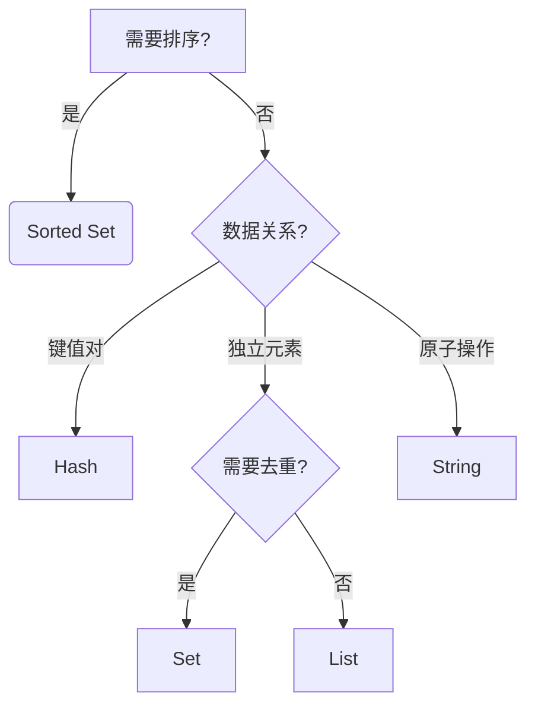

# Redis基本数据类型详解：底层实现与应用场景


## 一、Redis基本数据类型与底层结构

### 1. String（字符串）
- **核心特性**  
  可存储任意二进制数据（最大512MB），支持自增/自减操作。
- **底层结构**  
  **简单动态字符串（SDS）**：  
  - 预分配空间减少内存重分配次数 
  - 二进制安全（支持存储'\0'字符）
  - 记录长度字段实现O(1)复杂度获取字符串长度

- **适用场景**  
  ✅ 缓存系统（用户Session、页面内容）  
  ✅ 计数器（文章阅读量、秒杀库存）  
  ✅ 分布式锁（SETNX命令实现原子性）


---

### 2. Hash（哈希表）
- **核心特性**  
  存储字段-值映射关系，适合表示对象。
- **底层结构**  
  动态切换两种结构：  
  - **压缩列表（ZIPLIST）** ：字段数<512且字段值<64字节时使用 
  - **哈希表（DICT）** ：大字段时转为哈希表，链式解决哈希冲突

- **适用场景**  
  ✅ 用户属性存储（姓名、年龄等字段独立更新）  
  ✅ 商品规格参数（不同SKU的动态属性）  
  ✅ 配置信息分组管理（按模块划分字段）


---

### 3. List（列表）
- **核心特性**  
  双向可操作的有序集合，支持栈/队列模式。
- **底层结构**  
  **快速列表（QUICKLIST）**：  
  - 由多个ZIPLIST节点组成的双向链表
  - 平衡内存碎片与访问效率
  - LPUSH/RPOP操作时间复杂度O(1)

- **适用场景**  
  ✅ 消息队列（LPUSH+BRPOP实现阻塞队列）  
  ✅ 最新文章列表（LTRIM保持固定长度）  
  ✅ 分页查询（LRANGE实现范围读取）


---

### 4. Set（集合）
- **核心特性**  
  无序且元素唯一，支持交并差运算。
- **底层结构**  
  动态切换两种结构：  
  - **整数集合（INTSET）** ：全整数且元素<512时使用 
  - **哈希表（DICT）** ：存储元素作为哈希键（Value设为NULL）

- **适用场景**  
  ✅ 标签系统（用户兴趣标签去重）  
  ✅ 共同好友计算（SINTERSTORE求交集）  
  ✅ 抽奖系统（SRANDMEMBER随机选取）


---

### 5. Sorted Set（有序集合）
- **核心特性**  
  通过Score值排序，元素唯一但Score可重复。
- **底层结构**  
  双结构协同工作：  
  - **跳跃表（SKIPLIST）** ：实现O(logN)范围查询
  - **压缩列表（ZIPLIST）** ：元素数<128且值<64字节时使用
  - 哈希表辅助快速查找元素Score值

- **适用场景**  
  ✅ 实时排行榜（ZREVRANGE获取TOP N）  
  ✅ 延迟队列（Score存执行时间戳）  
  ✅ 地理位置排序（Score存储距离值）

总结：
| 数据类型    | 底层结构                  | 写入复杂度 | 查询复杂度  | 内存效率 | 典型场景                  |
|-------------|---------------------------|------------|-------------|----------|---------------------------|
| String      | SDS                       | O(1)       | O(1)        | 中       | 缓存、计数器              |
| Hash        | ZIPLIST/HASHTABLE         | O(1)       | O(1)\~O(n)   | 高       | 对象属性存储              |
| List        | QUICKLIST                 | O(1)       | O(n)        | 中       | 消息队列、时间线          |
| Set         | INTSET/HASHTABLE          | O(1)       | O(1)        | 低       | 关系运算、去重            |
| Sorted Set  | SKIPLIST/ZIPLIST          | O(logN)    | O(logN)     | 低       | 排行榜、范围查询          |


底层数据结构解析：

| 结构名称       | 核心优势                          | 典型应用               |
|----------------|-----------------------------------|------------------------|
| SDS            | 二进制安全/预分配优化             | String类型实现         |
| 压缩列表       | 内存紧凑/CPU缓存友好               | 小规模Hash/List存储    |
| 哈希表         | O(1)复杂度查找                     | 大规模Hash/Set存储     |
| 跳跃表         | 有序数据快速范围查询               | Sorted Set核心结构     |
| 快速列表       | 平衡内存碎片与访问效率             | List类型优化实现       |


数据类型选型



---

## 二、高级特性扩展
1. **位图（Bitmap）**  
   - 使用String类型实现位操作
   - 适用场景：用户签到统计、布隆过滤器

2. **HyperLogLog**  
   - 基数估算（误差<1%）
   - 适用场景：UV统计（10亿数据仅需12KB）

3. **流（Stream）**  
   - 消息持久化与消费组管理
   - 适用场景：物联网设备日志收集

使用场景总结：

    高频更新数据 优先选用String/Hash  
    关系运算需求 选择Set/Sorted Set  
    顺序访问场景 采用List/Stream  

## 三、常用命令
### 1. String（字符串）
| 命令                  | 说明                                 | 时间复杂度 |
|-----------------------|--------------------------------------|------------|
| `SET key value [EX seconds]` | 设置键值对（支持过期时间）          | O(1)       |
| `GET key`             | 获取键值                            | O(1)       |
| `INCR key`            | 整数值自增1                        | O(1)       |
| `DECR key`            | 整数值自减1                        | O(1)       |
| `APPEND key value`    | 追加字符串                          | O(1)       |
| `STRLEN key`          | 获取字符串长度                      | O(1)       |
| `MGET key1 key2...`   | 批量获取值                          | O(N)       |

**特殊场景命令**：  
- `SETNX key value` → 实现分布式锁
- `INCRBYFLOAT key 2.5` → 浮点数运算

---

### 2. Hash（哈希表）
| 命令                  | 说明                                 | 时间复杂度 |
|-----------------------|--------------------------------------|------------|
| `HSET key field value` | 设置字段值                          | O(1)       |
| `HGET key field`      | 获取字段值                          | O(1)       |
| `HMSET key f1 v1 f2 v2` | 批量设置字段（已弃用，用HSET替代） | O(N)       |
| `HGETALL key`         | 获取所有字段值                      | O(N)       |
| `HDEL key field1...`  | 删除指定字段                        | O(N)       |
| `HINCRBY key field 1` | 数值字段自增                        | O(1)       |

**复合操作**：  
- `HSCAN key cursor` → 安全遍历大哈希表
- `HEXISTS key field` → 检查字段是否存在

---

### 3. List（列表）
| 命令                  | 说明                                 | 时间复杂度 |
|-----------------------|--------------------------------------|------------|
| `LPUSH key value1...` | 左端插入元素                        | O(N)       |
| `RPUSH key value1...` | 右端插入元素                        | O(N)       |
| `LPOP key`            | 左端弹出元素                        | O(1)       |
| `LRANGE key 0 -1`     | 获取指定范围元素                    | O(N)       |
| `LTRIM key 0 100`     | 裁剪列表保留指定区间                | O(N)       |
| `BLPOP key1... timeout` | 阻塞式左端弹出                     | O(1)       |

**高级特性**：  
- `BRPOPLPUSH src dst timeout` → 安全队列实现
- `LINDEX key 5` → 随机访问（慎用，O(N)复杂度）

---

### 4. Set（集合）
| 命令                  | 说明                                 | 时间复杂度 |
|-----------------------|--------------------------------------|------------|
| `SADD key member1...` | 添加元素                            | O(N)       |
| `SREM key member1...` | 删除元素                            | O(N)       |
| `SMEMBERS key`        | 获取所有元素                        | O(N)       |
| `SISMEMBER key member` | 判断元素是否存在                   | O(1)       |
| `SINTER key1 key2...` | 计算多个集合的交集                  | O(N*M)     |
| `SCARD key`           | 获取元素总数                        | O(1)       |

**扩展命令**：  
- `SPOP key` → 随机移除元素（抽奖场景）
- `SUNIONSTORE dst key1 key2` → 存储并集结果

---

### 5. Sorted Set（有序集合）
| 命令                  | 说明                                 | 时间复杂度 |
|-----------------------|--------------------------------------|------------|
| `ZADD key score1 member1...` | 添加带分值的元素            | O(logN)    |
| `ZRANGE key 0 -1 WITHSCORES` | 按分值升序获取元素          | O(logN+M)  |
| `ZREVRANGE key 0 10` | 按分值降序获取TOP10元素      | O(logN+M)  |
| `ZRANK key member`    | 获取元素升序排名             | O(logN)    |
| `ZCOUNT key 80 100`   | 统计80-100分值区间的元素数量 | O(logN)    |
| `ZINCRBY key 5 member` | 增加元素分值                | O(logN)    |

**范围查询命令**：  
- `ZRANGEBYSCORE key 1600000000 1700000000` → 时间窗口查询
- `ZREMRANGEBYRANK key 0 -11` → 删除排名后10位的元素

---

### 6. 特殊类型补充
#### Bitmaps（位图）
```bash
SETBIT login:202310 5 1 # 记录用户ID=5的登录状态
BITCOUNT login:202310 # 统计当月登录用户数
BITOP OR result key1 key2 # 位运算合并
```

#### HyperLogLog
```bash
PFADD uv:article1 user123
PFCOUNT uv:article1 # 估算独立访客数
PFMERGE total uv:article1 uv:article2
```


命令使用原则:

    批量操作优先：使用`MSET`/`HMSET`替代多次`SET`  
    危险命令规避：`KEYS *`改用`SCAN`迭代  
    复杂度控制：避免在大数据集使用`SMEMBERS`，优先`SSCAN`  
    管道优化：将多个命令打包发送减少网络开

### 7.扩展
使用**RedisJSON**模块直接处理JSON字段
```bash
JSON.SET user:1000 .address.city "深圳"
```
**向量搜索**
```bash
FT.CREATE idx:products SCHEMA
name TEXT
embedding VECTOR FLAT 6 DIM 768 DISTANCE_METRIC L2
```


