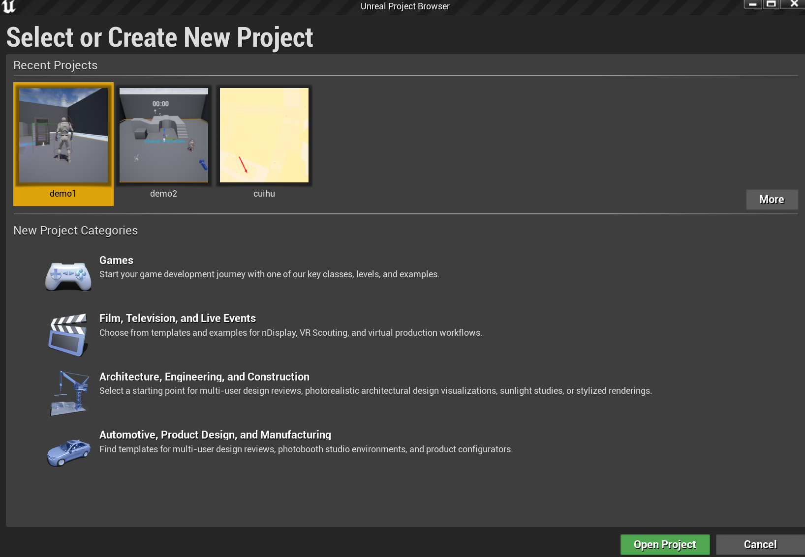

# UE术语概览

## 一、UE简介
**虚幻引擎（Unreal Engine，简称UE）** 是由Epic Games开发的一款综合性实时3D创作工具。它不仅是游戏开发的核心引擎，还广泛应用于影视动画、虚拟现实（VR）、增强现实（AR）、建筑可视化等领域。UE的核心优势在于其高度可扩展的工具集，包括：

| 功能模块           | 描述                                                                 |
|--------------------|----------------------------------------------------------------------|
| **图形渲染**       | 支持物理渲染（PBR）、全局光照（Lumen）、高动态范围（HDR）等技术 |
| **物理模拟**       | 支持刚体、布料、流体、破坏效果等复杂物理交互                     |
| **蓝图系统**       | 可视化编程工具，无需代码即可实现游戏逻辑                  |
| **跨平台支持**     | 覆盖Windows、iOS、Android、主机等多平台                          |

---

## 二、UE核心术语解析

### 1. 项目（Project）
**定义**：项目是UE开发的基本单元，包含游戏的所有资源和代码，对应磁盘上的文件夹结构。  
**核心文件**：
- **.uproject**：项目入口文件，记录名称、引擎版本等信息  
- **.Build.cs**：定义项目依赖的模块  
- **Content目录**：存放所有资源文件（如材质、模型、蓝图）  

**项目结构**：
```text
Project/
├── Config/ # 配置文件
├── Content/ # 资源文件（.uasset）
├── Source/ # C++源代码
│ ├── Public/ # 公共头文件
│ └── Private/ # 私有实现文件
└── Saved/ # 临时生成文件
```

---

### 2. 关卡（Level）
**定义**：关卡是玩家活动的场景，由Actor构成。一个世界（World）可由多个关卡动态加载组成，支持开放式大场景或线性流程设计。  
**关键文件**：
- **.umap**：关卡文件，包含所有放置的Actor信息  
**层级关系**：
```text
World（世界）
└── Level（主关卡）
└── Sub-Levels（子关卡）
```

---

### 3. Actor
**定义**：所有可放入关卡的对象统称为Actor，包括可见的模型、光源，以及不可见的触发体积等。  
**特性**：
- **支持变换**：平移、旋转、缩放
- **组件挂载**：通过添加组件（Component）扩展功能（如碰撞、动画）
- **生命周期**：可通过代码动态生成或销毁  

**常见类型**：
- StaticMeshActor（静态模型）
- CameraActor（摄像机）
- TriggerVolume（触发体积）

---

### 4. Pawn
**定义**：Pawn是可被控制器（Controller）操纵的Actor，代表游戏中的物理实体（如玩家角色、NPC）。  
**特点**：
- **控制分离**：通过PlayerController（玩家）或AIController（AI）实现逻辑解耦
- **输入响应**：处理移动、跳跃等基础行为  
**继承关系**：

```text
UObject → AActor → APawn → ACharacter
```

---

### 5. 世界（World）
**定义**：世界是所有关卡的容器，负责管理关卡的加载、卸载和动态Actor的生成。  
**类型**：
- **Game World**：实际游戏运行的世界
- **Editor World**：编辑模式下的世界
- **PIE World**：编辑器内测试时生成的临时世界  

**核心管理机制**：
- **流式加载**：动态加载子关卡以优化性能
- **世界上下文（WorldContext）** ：跟踪多个世界的状态（如编辑器与游戏世界共存）

---

### 6. 玩家控制器（Player Controller）
**定义**：连接玩家输入与Pawn的桥梁，处理键盘、鼠标等交互事件。  
**功能**：
- **输入处理**：将按键事件转化为Pawn动作（如移动、攻击）
- **视角控制**：管理摄像机位置和旋转
- **状态持久化**：保存玩家分数等跨关卡数据  

**与Pawn的关系**：
```text
PlayerController → Possess → Pawn
```

---
### 7. 组件（Component）
**定义**：组件就是构成 Actor 的零碎部分。 例如，汽车上的车轮、方向盘以及车身和车灯等都可以看作组件，而汽车本身就是 Actor。

添加了构成 Actor 的组件后，即使不编写蓝图脚本（或 C++ 代码）来设置汽车的功能，你也可以将汽车 Actor 放置在关卡中。 “油门踏板”相当于一个组件，你通过脚本或代码来指定踏板是否踩下，从而为汽车编写加速逻辑。 可以此种方式访问每个组件（打开车灯、按喇叭、开启收音机、转动方向盘等）

### 8. 蓝图（Blueprint）
**定义**：基于节点的可视化脚本系统，允许非程序员创建游戏逻辑。  
**核心元素**：
- **事件（Event）** ：如`BeginPlay`、`Tick`
- **函数（Function）** ：可重用的逻辑块
- **变量（Variable）** ：存储数据供节点调用  

**优点与局限**：
| 优点                     | 局限                     |
|--------------------------|--------------------------|
| 无需编程基础即可上手     | 复杂逻辑易导致节点冗余   |
| 实时编译快速迭代         | 性能低于C++代码          |
| 支持资源组合与继承       | 调试难度较高             |

---

## 三、UE核心架构示意图
```text
Engine → GameInstance → WorldContext → World → Level → Actor → Component
```
- **层级逻辑**：引擎管理全局实例（GameInstance），世界上下文协调多个世界，关卡组织Actor，Actor通过组件实现具体功能。

---


<!--   -->